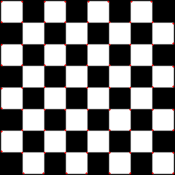
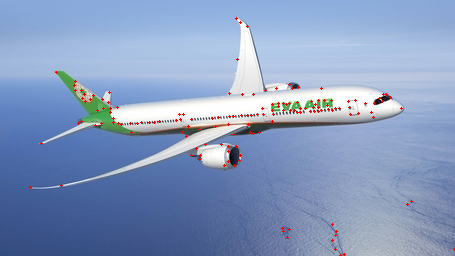
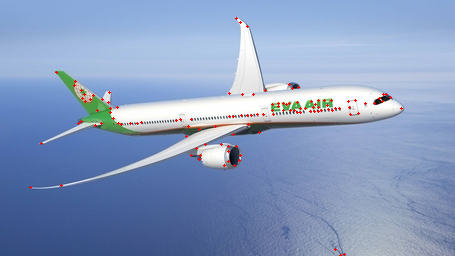
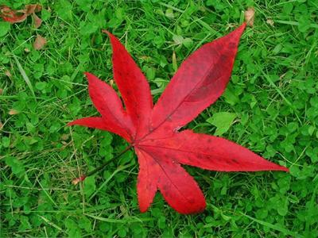
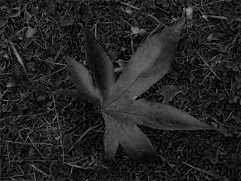
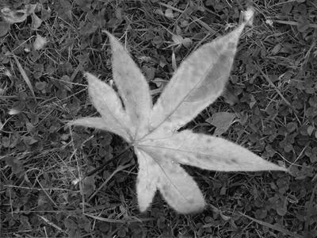
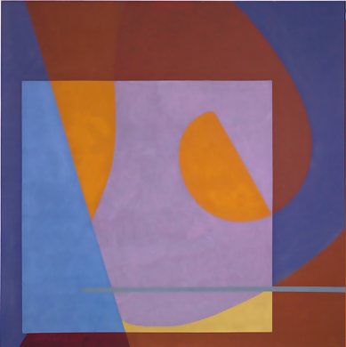
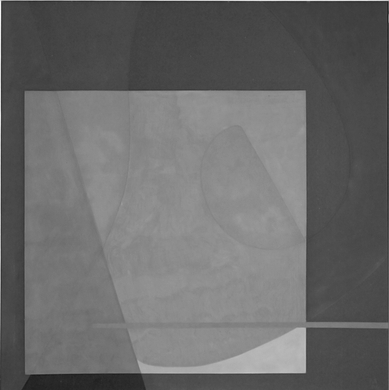
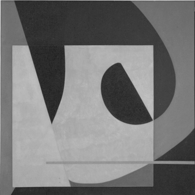

<center><font size="30"><b>EE5053 Hw1</b></font></center>

<center><span style="font-weight:light; color:#7a7a7a; font-family:Merriweather;">b06902034 </span><span style="font-weight:light; color:#7a7a7a; font-family:Noto Serif CJK SC;">黃柏諭</span></center>

---

## Part 1

* Detected corner with threshold 100

    |  |  |  |
    | ---------------------------- | ---------------------------- | ---------------------------- |
    | 1.png                        | 2.png                        | 3.png                        |

    

* Different threshold on 2.png

    |  |  |  |
    | --------------------------- | --------------------------- | ---------------------------- |
    | threshold = 25              | threshold = 50              | threshold = 100              |

    可以看到threshold的改變是對判斷corner的敏感度有影響的。以threshold=25和threshold=50來說，差異最明顯的是右下角的海面波紋，較高的threshold可以避免誤判。而threshold=50和threshold=100差異較不明顯，除了在一些機身上的顏色差異會讓threshold=50判定為corner，其餘飛機周圍的corner大致都是相同的標準。

## Part 2

### Results

* 1.png, $\sigma_s=2, \sigma_r=0.1$

| Parameter           | L1 Error |
| ------------------- | -------- |
| cv2.COLOR_BGR2GRAY  | 1207799  |
| R=0.0, G=0.0, B=1.0 | 1439568  |
| R=0.0, G=1.0, B=0.0 | 1305961  |
| R=0.1, G=0.0, B=0.9 | 1390632  |
| R=0.1, G=0.4, B=0.5 | 1279448  |
| R=0.8, G=0.2, B=0.0 | 1127756  |

| Original                  | Highest(R=0.0, G=0.0, B=1.0)         | Lowest(R=0.8, G=0.2, B=0.0) |
| ------------------------- | ------------------------------------ | ------------------------------------ |
|  |   |  |
|                           |  |  |


* 2.png, $\sigma_s=1, \sigma_r=0.05$


| Parameter | L1 Error |
| ------------------- | ----------------------------------- |
| cv2.COLOR_BGR2GRAY  | 183851 |
| R=0.1, G=0.0, B=0.9 | 77973 |
| R=0.2, G=0.0, B=0.8 | 85973 |
| R=0.2, G=0.8, B=0.0 | 188129 |
| R=0.4, G=0.0, B=0.6 | 128257 |
| R=1.0, G=0.0, B=0.0 | 110862 |

| Original                  | Highest(R=0.2, G=0.8, B=0.0) | Lowest(R=0.1, G=0.0, B=0.9)          |
| ------------------------- | ------------------------------------ | ------------------------------------ |
|  |  |  |
|                           |  |  |

從1.png的結果來看，L1 error較小的gray scale方法確實比較容易以肉眼的分原圖的物體色差較大的部份（例如葉子和草地，error最大的圖看起來葉子和草地幾乎是一樣的），但主觀的感受我覺得error最小的結果有點違背平常我們看到的灰階影像。2.png中可以明顯的看到error最大的結果幾乎讓中間幾塊顏色的灰階值相當接近，外圍顏色也類似，而error最小的可以明顯看出色塊差異。


### Speed Up Bilateral Filter

#### Environment & Test

* OS: Ubuntu18.04, 5.4.0-70-generic
* CPU: AMD R5-3600 @ 3.6 GHz
* RAM: 16GB
* Test: 在ex.png上以`eval.py`的預設參數運行十次取mean

#### Method

##### Look Up Table

為了避免多次exponential運算，可以在initialize時先把$G_s$ kernel 算出來。此外由於pixel差值$\delta$僅有256種可能，可以先算出$e^{-\frac{\delta}{2\sigma^2}}$並存起來。對於3通道guidance可以把$e^{-\frac{\delta_r+\delta_g+\delta_b}{2\sigma^2}}$拆成$e^{-\frac{\delta_r}{2\sigma^2}} \cdot e^{-\frac{\delta_r}{2\sigma^2}} \cdot e^{-\frac{\delta_r}{2\sigma^2}}$，只要access table三次並做兩次乘法即可。

在之後提及的方法測試中都有使用Look Up Table。

##### Array Multiplication

np.array在做矩陣點乘時有使用到平行化，因此避免使用for loop讓np.array一次對多值運算會比較好。以下是兩種乘法的實作方式。

* Array Multiplication Method A: 直覺作法
	```python
'''
  img_row: row number of original image
  img_col: column number of original image
  padd_img_submatrix: submatrix of padded image with size same as kernel
  '''
  for i in range(img_row):
	  for j in range(img_column):
	      range_kernel = get_range_kernel(i, j)
	      tmp_kernel = spatial_kernel * range_kernel
	      output[i, j] = np.sum(tmp_kernel * img_submatrix, axis=(0, 1))
	      output[i, j] /= np.sum(tmp_kernel)
	```
	
	測試運行秒數為2.42秒
	
* Array Multiplication Method B: 投影片中提示的作法

    ```python
    '''
    img: original image
    shift_padded_img_submatrix: submatrix of padded img shift by (i, j) with size same as img
    range_kernel_table: look up talbe of range kernel
    '''
    for i in range(-pad_size, pad_size + 1):
        for j in range(-pad_size, pad_size + 1):
            tmp_matrix = range_kernel_table[shift_padded_img_submatrix - padded_img]
            tmp_matrix *= spatial_kernel[i, j]
            output += tmp_matrix * shift_padded_img_submatrix
            weight += tmp_matrix
    output /= weight
    ```
    

測試運行秒數為0.57秒。

儘管乘法與減法的總量一樣，不過Method B善用了np.array的平行化優勢提昇單次的運算量，讓運行效能提昇了4-5倍。

##### Multiprocessing

由於規定是不能更改`eval.py`的，也不確定最終助教測試時的class insinuate位置。因此要在class method中使用multiprocessing還要避免python用pipe傳送資料給subprocess拖慢速度的話只能用global來解決，只需要讀的變數可以直接宣告global讓subprocess用copy-on-write讀，不需要額外記憶體。然而output/weight是需要寫回main process的，要用return value或是shared memory來紀錄。以下為幾種嘗試過的方法。

* Parallelize on Array Multiplication Method A

    單個output pixel的計算沒有dependency的問題，因此可以把每個pixel都開一個subprocess去處理。由於每個process的output都是獨立的記憶體位置，不需要處理lock的問題。

    * 每個pixel都開一個process處理：測試秒數為0.55秒，效能為4.4倍。

    * 每個row都開一個process處理：測試秒數為0.37秒，效能為6.5倍。

    由於context switch也是要時間成本，因此對row分process比對pixel快也是可以預期的。

* Parallelize on Array Multiplication Method B

    最直覺的方式是按照每個kernel的element去分成$\text{kernel_size}^2$個process，然而output/weight array是共用寫入的，因此需處理lock或是存在return value，最後再用main process合併。

    * lock on memory: 測試秒數為0.42秒，效能為1.35倍。
    * store in return value: 測試秒數為1.97秒，效能約為0.3倍。

    lock on memory可以些微提昇效能，但是在allocate lock也會需要時間成本。由於return value需要另外動態allocate memory去存取，此時的時間瓶頸已經不是運算而是記憶體操作了，因此效能下降了非常多。解決方式也許可以在object initialize時就先allocate $\text{kernel_size}^2$倍的記憶體，不過也不確定測試時的圖片大小以及環境可用的記憶體，因此就沒做了。

    另一種平行化方式是直接對圖片分塊，分給不同process做，這樣會犧牲np.array平行化運算的效能，不過可以徹體使用其他核心。測試後決定以row為單位並大約2000個element分一塊。

    * 圖片按row分塊: 測試秒數為0.11秒，效能為5倍。

    最後決定用此方案。

