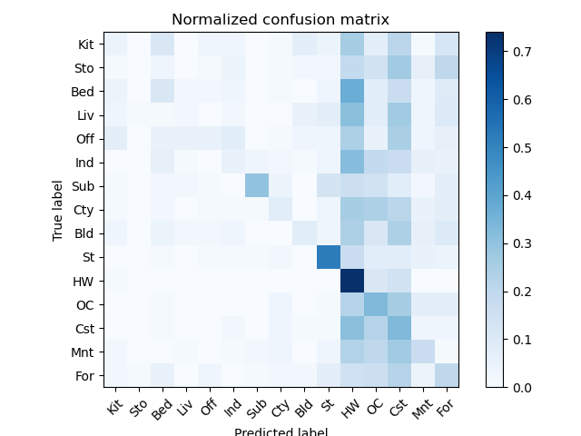
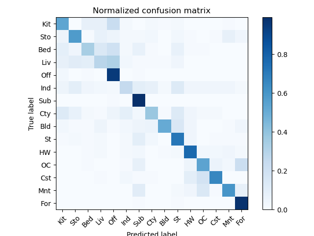
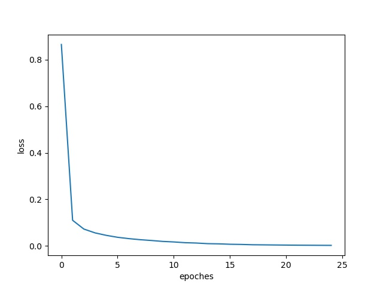
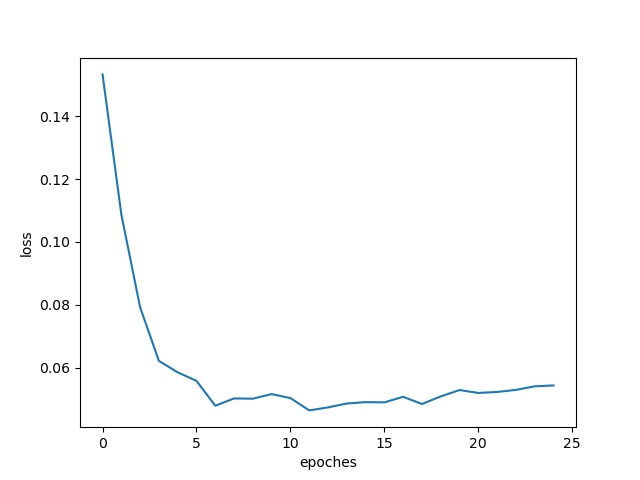
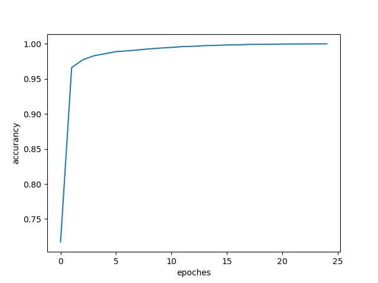
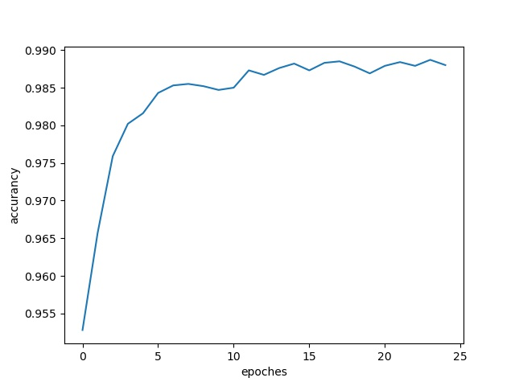
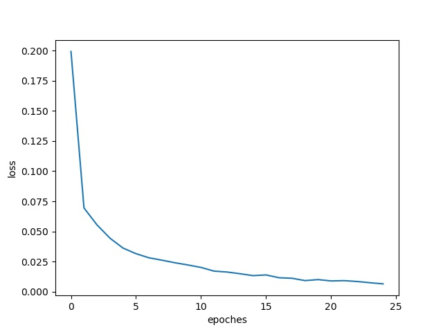
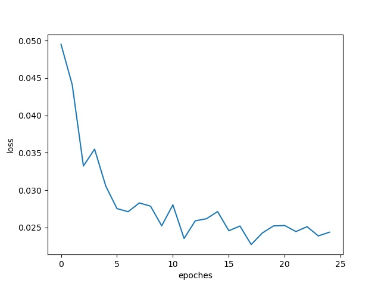
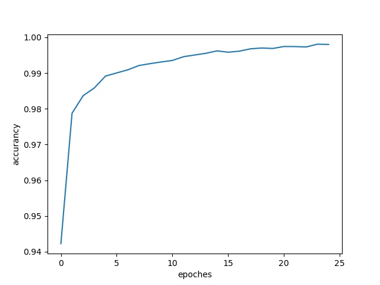
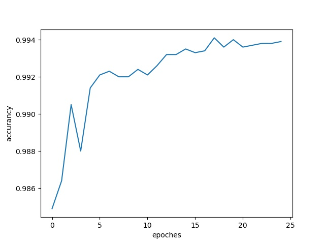

<center><font size="30"><b>EE5053 Hw2</b></font></center>

<center><span style="font-weight:light; color:#7a7a7a; font-family:Merriweather;">b06902034 </span><span style="font-weight:light; color:#7a7a7a; font-family:Noto Serif CJK SC;">黃柏諭</span></center>

---

## Part 1

* Accuracy

    * Tiny Image: 0.20133333333333334
    * Bag of Sift: 0.606

* Confusion Matrix

    * | Tiny Image                | Bag of Sift                |
        | ------------------------- | -------------------------- |
        |  |  |

    * Bag of Sift 的表現明顯較佳，他比起Tiny Image更能找出合理的feature。Tiny Image在High Way預設的表現是最好的，推測是因為圖片下方大多是大面積的灰色公路，在縮小後還能保有特徵，也因此很多其他種類的圖片都錯誤的被分到High Way。而Bag of Sift在Industrial的表現較差，推測試因為圖片中的工廠有許多外型，很難像Forest之類的類別的找出類似的特徵。

## Part 2

* Architectures and Parameters

    * ConvNet

        ```
        ConvNet(
          (cnn): Sequential(
            (0): Conv2d(1, 6, kernel_size=(5, 5), stride=(1, 1))
            (1): ReLU()
            (2): MaxPool2d(kernel_size=2, stride=2, padding=0, dilation=1, ceil_mode=False)
            (3): Conv2d(6, 16, kernel_size=(5, 5), stride=(1, 1))
            (4): ReLU()
            (5): MaxPool2d(kernel_size=2, stride=2, padding=0, dilation=1, ceil_mode=False)
          )
          (linear): Sequential(
            (0): Linear(in_features=256, out_features=120, bias=True)
            (1): ReLU()
            (2): Linear(in_features=120, out_features=84, bias=True)
            (3): ReLU()
            (4): Linear(in_features=84, out_features=10, bias=True)
            (5): ReLU()
          )
        )
        # of parameters:  44426
        ```

    * MyNet

        ```
        MyNet(
          (cnn): Sequential(
            (0): Conv2d(1, 32, kernel_size=(3, 3), stride=(1, 1))
            (1): ReLU()
            (2): BatchNorm2d(32, eps=1e-05, momentum=0.1, affine=True, track_running_stats=True)
            (3): Conv2d(32, 32, kernel_size=(3, 3), stride=(1, 1))
            (4): ReLU()
            (5): BatchNorm2d(32, eps=1e-05, momentum=0.1, affine=True, track_running_stats=True)
            (6): Conv2d(32, 32, kernel_size=(5, 5), stride=(2, 2), padding=(2, 2))
            (7): ReLU()
            (8): BatchNorm2d(32, eps=1e-05, momentum=0.1, affine=True, track_running_stats=True)
            (9): Dropout2d(p=0.4, inplace=False)
            (10): Conv2d(32, 64, kernel_size=(3, 3), stride=(1, 1))
            (11): ReLU()
            (12): BatchNorm2d(64, eps=1e-05, momentum=0.1, affine=True, track_running_stats=True)
            (13): Conv2d(64, 64, kernel_size=(3, 3), stride=(1, 1))
            (14): ReLU()
            (15): BatchNorm2d(64, eps=1e-05, momentum=0.1, affine=True, track_running_stats=True)
            (16): Conv2d(64, 64, kernel_size=(5, 5), stride=(2, 2), padding=(2, 2))
            (17): ReLU()
            (18): BatchNorm2d(64, eps=1e-05, momentum=0.1, affine=True, track_running_stats=True)
            (19): Dropout2d(p=0.4, inplace=False)
            (20): Conv2d(64, 128, kernel_size=(4, 4), stride=(1, 1))
            (21): ReLU()
            (22): BatchNorm2d(128, eps=1e-05, momentum=0.1, affine=True, track_running_stats=True)
            (23): Dropout2d(p=0.4, inplace=False)
          )
          (linear): Sequential(
            (0): Linear(in_features=128, out_features=10, bias=True)
          )
        )
        # of parameters:  326410
        ```

* Learning Curve

    * ConvNet

        | Train                     | Validation               |
        | ------------------------- | ------------------------ |
        |  |  |
        |   |   |

    * MyNet

        | Train                     | Validation               |
        | ------------------------- | ------------------------ |
        |  |  |
        |   |   |

* Compare
    * ConvNet在validaion set的準確率約為0.988，MyNet約為0.994。這邊ConvNet使用的架構是LeNet 5，我自己在做MyNet時還蠻難超越LeNet的，就算是多加幾層Conv2d也不會好多少。之後參考了Kaggle上其他人的做法再簡化才生出MyNet。MyNet的參數量約為ConvNet的八倍，因此收斂速度較慢，不過最終的loss也較低。

## Reference

https://www.kaggle.com/cdeotte/how-to-choose-cnn-architecture-mnist