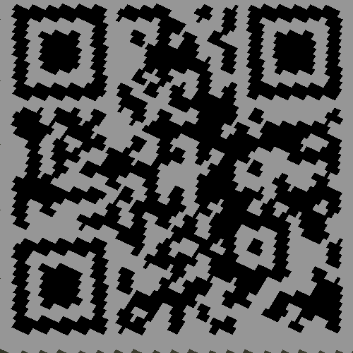
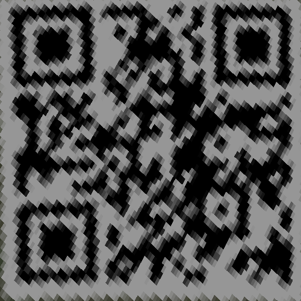
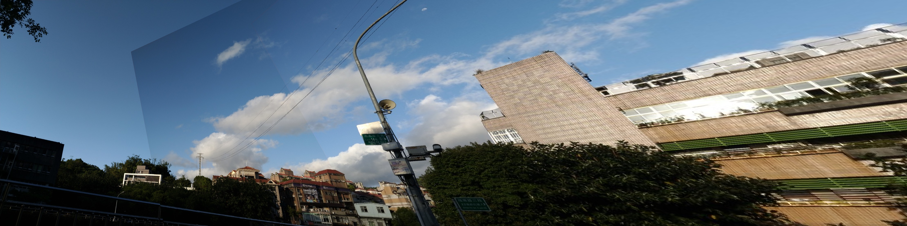

<center><font size="30"><b>EE5053 Hw3</b></font></center>

<center><span style="font-weight:light; color:#7a7a7a; font-family:Merriweather;">b06902034 </span><span style="font-weight:light; color:#7a7a7a; font-family:Noto Serif CJK SC;">黃柏諭</span></center>

---

## Part 1

#### Code

```python
def solve_homography(u, v):
    N = u.shape[0]
    H = None

    if v.shape[0] is not N:
        print('u and v should have the same size')
        return None
    if N < 4:
        print('At least 4 points should be given')

    A = []
    for i in range(N):
        A.append([u[i][0], u[i][1], 1, 0, 0, 0, -u[i][0] * v[i][0], -u[i][1] * v[i][0], -v[i][0]])
        A.append([0, 0, 0, u[i][0], u[i][1], 1, -u[i][0] * v[i][1], -u[i][1] * v[i][1], -v[i][1]])
    A = np.array(A)

    _, _, vh = np.linalg.svd(A)
    H = np.reshape(vh[-1, :], (3, 3))
    H /= H[2, 2]
    return H
```

#### Results


## Part 2

#### Code

```python
def warping(src, dst, H, ymin, ymax, xmin, xmax, direction='b', v=None, alpha=0):
    h_src, w_src, ch = src.shape
    h_dst, w_dst, ch = dst.shape
    H_inv = np.linalg.inv(H)

    if direction == 'b':
        x, y = np.meshgrid(np.arange(xmin, xmax), np.arange(ymin, ymax))
        ones = np.ones_like(x)
        p = np.dstack((x, y, ones)).reshape(-1, 3).T
        points = p.T[:, 0:2]
        p = H_inv @ p
        p /= p[2]
        p = p.T[:, 0:2].reshape(ymax - ymin, xmax - xmin, 2)
        p = np.around(p).astype(np.int)

        path = Path(v)
        mask = path.contains_points(points, radius=1e-9).reshape(ymax - ymin, xmax - xmin)
        px = np.where(np.logical_and(p[:, :, 0] < src.shape[1], p[:, :, 0] >= 0), True, False)
        py = np.where(np.logical_and(p[:, :, 1] < src.shape[0], p[:, :, 1] >= 0), True, False)

        pts = np.argwhere(mask & px & py)
        
        dst[pts[:, 0] + ymin, pts[:, 1] + xmin] = np.where(dst[pts[:, 0] + ymin, pts[:, 1] + xmin] > 0, alpha * dst[pts[:, 0] + ymin, pts[:, 1] + xmin] + (1 - alpha) * src[p[pts[:, 0], pts[:, 1], 1], p[pts[:, 0], pts[:, 1], 0]], src[p[pts[:, 0], pts[:, 1], 1], p[pts[:, 0], pts[:, 1], 0]])

    elif direction == 'f':
        x, y = np.meshgrid(np.arange(xmin, xmax), np.arange(ymin, ymax))
        ones = np.ones_like(x)
        p = np.dstack((x, y, ones)).reshape(-1, 3).T
        p = H @ p
        p /= p[2]
        p = p.T[:, 0:2].reshape(ymax - ymin, xmax - xmin, 2)
        p = np.around(p).astype(np.int)

        px = np.where(np.logical_and(p[:, :, 0] < dst.shape[1], p[:, :, 0] >= 0), True, False)
        py = np.where(np.logical_and(p[:, :, 1] < dst.shape[0], p[:, :, 1] >= 0), True, False)
        flt = np.repeat((px & py)[:, :, np.newaxis], 2, axis=2)
        p = np.where(flt, p, -1)

        dst[p[:, :, 1], p[:, :, 0]] = src[ymin : ymax, xmin : xmax]

    return dst
```

#### Interpolation Method

用 `np.around()` 實作在 Manhattan distance 下的 nearest-neighbor interpolation。

## Part 3

#### Unwarped QR Code

|  |  |
| ---------------------- | ---------------------- |
| BL_secret1.png         | BL_secret2.png         |

#### Results

* BL_secret1.png: https://qrgo.page.link/jc2Y9

* BL_secret2.png: cannot decode

Decoder: https://zxing.org/w/decode

#### Discussion

根據助教提供的參考資料https://ww2.mathworks.cn/help/vision/ug/camera-calibration.html中提到真實的相機因為使用鏡片會產生distortion，不能單純用homography矩陣變換。而BL_secret2.png中看起來是使用廣角鏡頭拍攝且有positive radial distortion的情形，因此無法正確的被投影到平面上，應該還要先經過distortion的處理。BL_secret1.png看起來比較沒有distortion，較接近pinhole camera model。因此兩者投影出來的結果不同。

## Part 4

#### Results



#### Dicussion

本題使用homography方法基於平面的。因此若拍攝的物體很遠可以被近似於一個平面，或是只拍一面牆，且圖片本身符合pinhole camera所拍出來的影像沒有distortion，是可以拼接在一起的。若拍攝距離很進且物體有前後的關係沒辦法被視為一個平面，這時候拼接在一起就會顯得很奇怪，或甚至拼不起來。我自己嘗試以下的圖片是沒辦法的，但也有可能是角度改變之後feature match會抓錯。

|  |  |  |
| ----------------------- | ----------------------- | ----------------------- |
|                         |                         |                         |


### Bonus

#### Images of Panorma with more than 2 Images


選用一張feature match很容易錯掉的圖測試。左上角接合處的鍵帽有明顯的未對齊，可能是近距離拍攝時鍵帽有高低差沒辦法視為一個平面。

#### Alpha Blending

alpha = 0.5


左上角的接縫還是很明顯，也許要用color correction的方式才能修補掉。透過這個方法也可以看到右邊的接合處是有好好接合的。而電線的部份透過alpha blending可以看到其實沒有完全對齊，白雲也有殘影，可能是因為電線和雲的距離很遠沒辦法視為一個平面。