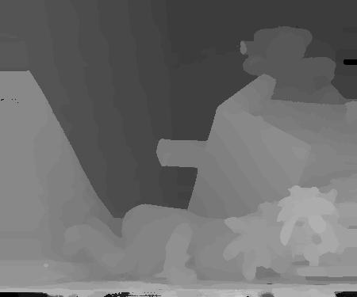

<b>EE5053 Hw4</b>

b06902034 黃柏諭

---

## Disparity Map

|    |  |
| ---------------- | -------------- |
|  |  |

## Bad Pixel Ratio

Tsukuba: 2.73%

Teddy: 9.32%

## Algorithm

#### Cost Computation

Use census cost with different size of windows.

| Small Window                                                 | Large Window                                                 |
| ------------------------------------------------------------ | ------------------------------------------------------------ |
|  |  |

Reference: Huang, CS., Huang, YH., Chan, DY. *et al.* Shape-reserved stereo matching with segment-based cost aggregation and dual-path refinement. *J Image Video Proc.* **2020,** 38 (2020). https://doi.org/10.1186/s13640-020-00525-3

Use Large Window on Tsukuba as it performs better.

### Cost Aggregation

Simply apply Joint Bilateral Filter on each disparity cost using the original RGB image as guide.

### Disparity Optimization

Simply apply Winner-take-all.

### Disparity Refinement

* Left-right consistency check

    If $D_L(x, y) \neq D_R(x - D_L(x, y), y)$  mark it as hole

* Hole filling

    * $F_L$ , the disparity map filled by closest valid disparity from left 

    * $F_R$, the disparity map filled by closest valid disparity from right
    * Final filled disparity map $D = \min(F_L, F_R)$ (pixel-wise minimum)

Reference: Homework 4 slides http://media.ee.ntu.edu.tw/courses/cv/21S/hw/hw4/hw4.pdf

### Hyper Parameter

* Grid search on Teddy and Tsukuba
* Try and observe by eye on Cones and Venus